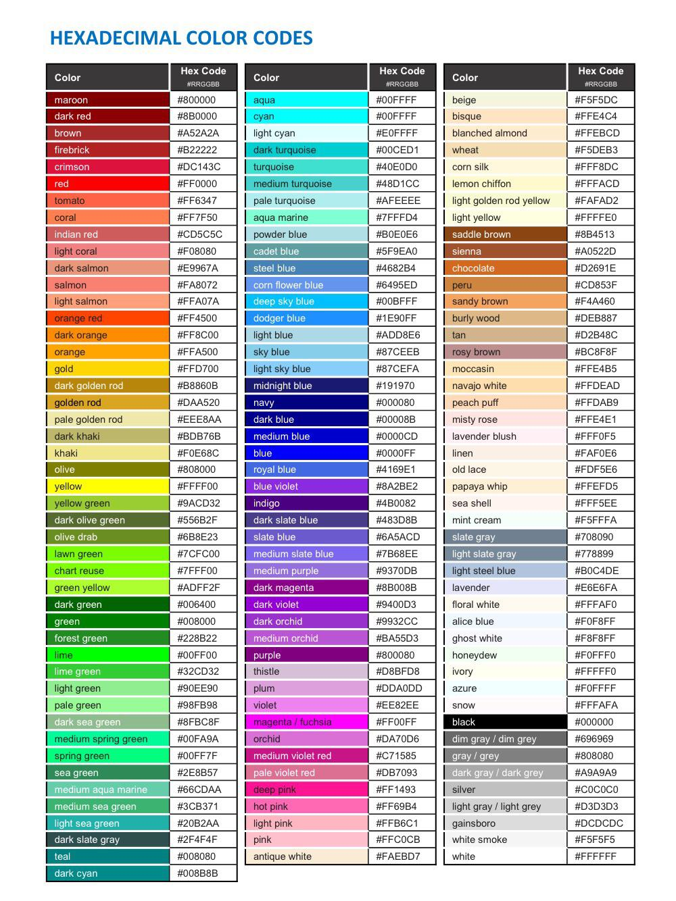

#### MASTER INDEX for
# CHEATSHEETS

This is the main index / directory / kiosk for navigating the rest of the files in this repo.

## Categories in this Repo:

- [How To](/how-to/index.md): How-to articles
- [Coding](/coding/index.md): Coding, programming, software development (see also [Shell](/shell/index.md))
- [Database](/database/index.md): Databases, SQL, spreadsheets
- [Design](/design/index.md): Graphic design, digital design
- [Email](/email/index.md)
- [Networking](/networking/index.md): Networking, CCNA, etc.
- [Operating Systems](/os/index.md): Linux, Windows, Mac, etc.
- [Productivity](/productivity/index.md): Office suites & productivity software
- [Shell](/shell/index.md): Command line (CLI) and shell-scripting
- [WordPress](/wp/index.md): WordPress CMS
- [SOP](/sop/index.md): Standards, styleguides, documentation conventions, etc.
- [Snippet Libraries](/_ref/): (WORK-IN-PROGRESS) `AI Prompts`, `Asana Comments`, `File Header Comments`, `Lorem Ipsum`, `Git Commit Messages`, `GitHub Pull Requests`, etc.
- [Resources](/resources/index.md): Non-documentation assets like office docs (*`DOCX`, `XLS`, `ODX`, etc.*), text-based data sets (*`CSV`, `TSV`*), design files (`PSD`, `INDD`, `AI`, etc.), and more.

## Quick Links

**[Hex color chart:](coding/html-hex-colors.md)** (named colors)

## PEOPLE

- [Non-Christian Coders]()
- [Christian Coders](/christians/index.md): Christian coders, apps, tech-adjacent groups, etc.

## MISC

- [RCHAIX](/rchaix/index.md): Notes from when I worked at IBM in Rochester, MN (2000-2002)
- [Eric's Projects](/my-projects/index.md): My code, designs, and projects I've contributed to.
- [AI Convos](/ai/index.md): A collection of conversations I've had with various AI to help troubleshoot technical issues, but also on pretty much any subject. This includes prompts and responses from generative AI or Chat AIs like ChatGPT, Dall-E, Bing Copilot, Photoshop Generative AI, etc.

## MY OTHER COLLECTIONS & WIKIS

- **Ministry**: ([local](/../_ministry/), [GitHub](https://github.com/codewizard13/ehw-ministry)) My experiences with finding Jesus, Christianity, atheism, world religions, cults, belief systems, etc.

- **Music**: ([local](/../_music/), [GitHub](https://github.com/codewizard13/ehw-music-docs.git)) My knowledge about and with music including songs, artists, theory, instruments, genres, playing styles, worship music, guitar ministry, etc.

## My Online Contributions & Writings in the Tech Space

- [My ChatGPT Posts](/my-projects/chat-gpt.md)

## Notes & Resources

- [Scripts & Tools](/tools/)

### Credits

- This format is based on [Christian Lempa's Cheatsheets](https://github.com/ChristianLempa/cheat-sheets/blob/main/linux/awk.md).
