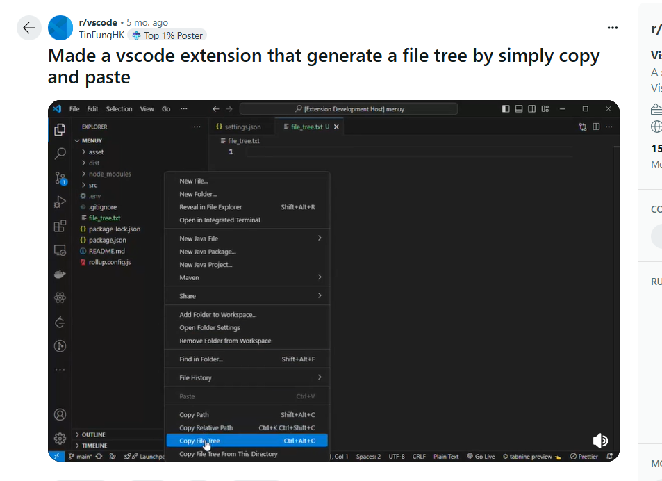

# How to Create an ASCII Folder Tree

####  [[This is a stub]]

[🏚️](../README.md) | [How To](/how-to/index.md)

## With tree.nathanfriend.io

Use the online tool at [https://tree.nathanfriend.io/](https://tree.nathanfriend.io/)

## With VSCode / Bash

Simply right-click on a folder in the sidebar and do "Copy Tree" then paste where you need it.

- [Reddit Post](https://www.reddit.com/r/vscode/comments/1fmn6ye/made_a_vscode_extension_that_generate_a_file_tree/)