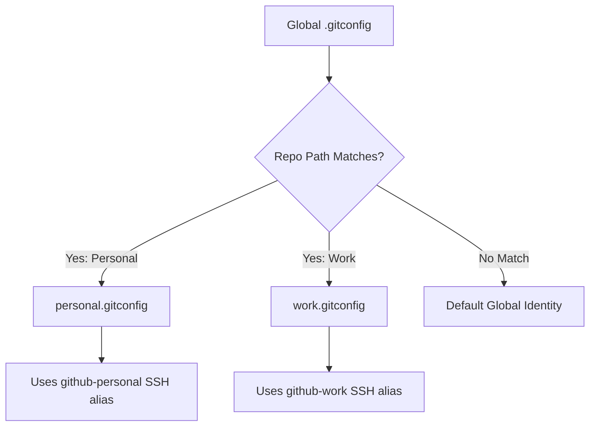

<!-- 🔗 Custom Stylesheet -->
<link rel="stylesheet" href="/_css/main.css">

<!-- 🖼️ Site Logo -->


<!-- 📝 Title -->
# HOW-TO: 📘 Switch Between Multiple GitHub Profiles in VSCode on Windows 11 + Git Bash

<!-- 🧭 Navigation -->
### [🏚️ Home](../README.md) | [📁 How-To](index.md)

<!-- 👤 Metadata -->
| **Author**:        | Eric L. Hepperle    |
| ------------------ | ------------------- |
| **Date Created**:  | 2025-09-11          |
| **Date Updated**:  | 2025-09-11          |
| **AI Assistance**: | ChatGPT, Perplexity |

---

<!-- 📚 References (Optional) -->
### References / See Also:

- [Placeholder 1](#)
- [Placeholder 2](#)

---

<!-- 🔍 Content Section Heading -->
Managing multiple GitHub accounts (e.g., **personal** and **work**) on the same machine can be a challenge, especially with SSH keys, Git config, and identity settings. This guide will walk you through a foolproof method to set it all up **step-by-step**, without skipping anything.

---

## 🛠️ Prerequisites

| Tool     | Required Version | Install Link                                            |
| -------- | ---------------- | ------------------------------------------------------- |
| Git      | Latest           | [git-scm.com](https://git-scm.com/)                     |
| VSCode   | Latest           | [code.visualstudio.com](https://code.visualstudio.com/) |
| Git Bash | Latest           | Comes with Git on Windows                               |
| GitHub   | Two accounts     | e.g., personal & work profiles                          |

---

## 📌 Overview

We'll use the following structure:

```bash
~/
├── .ssh/
│   ├── id_ed25519_personal
│   ├── id_ed25519_personal.pub
│   ├── id_ed25519_work
│   ├── id_ed25519_work.pub
│   └── config
├── git/
│   ├── personal.gitconfig
│   └── work.gitconfig
```

---

## Step 1: ✅ Generate SSH Keys for Each Account

### 🧍 Personal GitHub Account

```bash
ssh-keygen -t ed25519 -C "your_personal_email@example.com" -f ~/.ssh/id_ed25519_personal
```

> Hit `Enter` to accept the default file location and set a passphrase (optional but recommended).

### 👔 Work GitHub Account

```bash
ssh-keygen -t ed25519 -C "your_work_email@company.com" -f ~/.ssh/id_ed25519_work
```

---

## Step 2: 🧷 Add SSH Keys to the SSH Agent

Start the SSH agent:

```bash
eval "$(ssh-agent -s)"
```

Add both keys:

```bash
ssh-add ~/.ssh/id_ed25519_personal
ssh-add ~/.ssh/id_ed25519_work
```

> 🔐 You may be prompted for passphrases if you set them.

---

## Step 3: 🧭 Add SSH Keys to GitHub Accounts

1. Run the following to copy your public keys:

```bash
cat ~/.ssh/id_ed25519_personal.pub
cat ~/.ssh/id_ed25519_work.pub
```

2. Log in to each GitHub account and add the respective public key:

   * **GitHub → Settings → SSH and GPG keys → New SSH key**
   * Label clearly: e.g., *"Windows Laptop - Personal"*

---

## Step 4: 🧙 Configure SSH for Host Aliases

Edit the SSH config file:

```bash
nano ~/.ssh/config
```

Paste the following:

```ssh
# Personal GitHub
Host github-personal
    HostName github.com
    User git
    IdentityFile ~/.ssh/id_ed25519_personal
    IdentitiesOnly yes

# Work GitHub
Host github-work
    HostName github.com
    User git
    IdentityFile ~/.ssh/id_ed25519_work
    IdentitiesOnly yes
```

> 🧠 This allows you to refer to `github-personal` or `github-work` instead of `github.com`.

---

## Step 5: ⚙️ Set Up Global Git Config with Includes

We'll isolate Git identities using separate config files and a global config that includes them **per repository**.

### 🔧 Create Identity Config Files

#### Personal

```bash
mkdir -p ~/git
nano ~/git/personal.gitconfig
```

```ini
[user]
    name = Your Name
    email = your_personal_email@example.com
[core]
    sshCommand = ssh -i ~/.ssh/id_ed25519_personal -F /dev/null
```

#### Work

```bash
nano ~/git/work.gitconfig
```

```ini
[user]
    name = Your Name
    email = your_work_email@company.com
[core]
    sshCommand = ssh -i ~/.ssh/id_ed25519_work -F /dev/null
```

### 🌍 Update Global Git Config

```bash
git config --global includeIf.gitdir:~/Projects/Personal/.path ~/git/personal.gitconfig
git config --global includeIf.gitdir:~/Projects/Work/.path ~/git/work.gitconfig
```

> 🗂️ Replace `~/Projects/Personal/` and `~/Projects/Work/` with your actual repo paths.

---

## Step 6: 🧪 Clone Repos Using SSH Host Alias

### Personal Repo

```bash
git clone git@github-personal:yourusername/your-personal-repo.git
```

### Work Repo

```bash
git clone git@github-work:yourworkusername/your-work-repo.git
```

> ✅ The SSH host alias ensures the correct identity is used.

---

## Step 7: 🧩 Use Multiple Profiles in VSCode

No extra config is needed inside VSCode if you open the repo inside the proper folder:

* Repos under `~/Projects/Personal/` → personal identity
* Repos under `~/Projects/Work/` → work identity

🎯 You can verify with:

```bash
git config user.name
git config user.email
```

---

## 📈 Bonus: Mermaid Diagram of Git Config Flow



---

## 🧪 Final Testing Checklist

| ✅ Task                           | Command Example                                   |
| -------------------------------- | ------------------------------------------------- |
| Verify SSH connection (personal) | `ssh -T git@github-personal`                      |
| Verify SSH connection (work)     | `ssh -T git@github-work`                          |
| Verify Git user in repo          | `git config user.name && git config user.email`   |
| Test cloning repo                | `git clone git@github-personal:username/repo.git` |

---

## 🧹 Troubleshooting Tips

| Problem                              | Fix                                                                       |
| ------------------------------------ | ------------------------------------------------------------------------- |
| SSH key not being used               | Check `~/.ssh/config` and use `ssh -vT git@github-xxx` to debug           |
| Wrong identity in Git                | Verify with `git config user.email` in repo                               |
| Cannot clone                         | Make sure the SSH public key is added to the right GitHub account         |
| SSH key passphrase prompt every time | Use an SSH agent or consider setting up `ssh-agent` in your shell profile |

---

## 🎉 You're All Set!

Now you can easily work with multiple GitHub accounts, with clean isolation of identities and SSH keys—all without conflicts or headaches. Happy coding!


---

## ✅ Revision History

| Version | Date       | Author           | Changes Made          |
| ------- | ---------- | ---------------- | --------------------- |
| 1.0     | 2025-09-11 | Eric L. Hepperle | Initial draft created |

---
