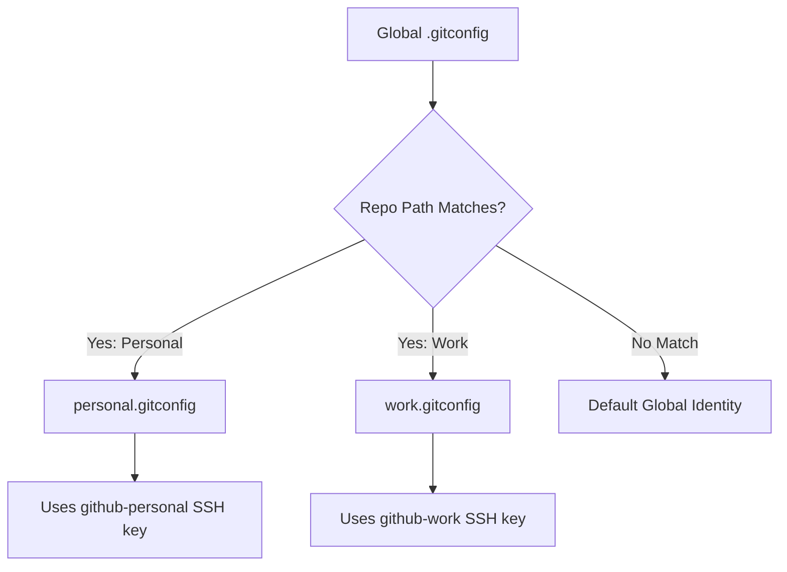

<!-- 🔗 Custom Stylesheet -->
<link rel="stylesheet" href="/_css/main.css">

<!-- 🖼️ Site Logo -->


<!-- 📝 Title -->
# HOW-TO: 📘 Using Multiple GitHub Profiles on One Machine


> Optimized for: VSCode on Windows 11 + Git Bash (SSH)
> 
(Version: 005)

<!-- 🧭 Navigation -->
### [🏚️ Home](../README.md) | [📁 How-To](index.md)

<!-- 👤 Metadata -->
| **Author**:        | Eric L. Hepperle    |
| ------------------ | ------------------- |
| **Date Created**:  | 2025-09-11          |
| **Date Updated**:  | 2025-09-11          |
| **AI Assistance**: | ChatGPT, Perplexity |

---

<!-- 📚 References (Optional) -->
### References / See Also:

- [Placeholder 1](#)
- [Placeholder 2](#)

---


<!-- 🔍 Content Section Heading -->
Managing multiple GitHub accounts (e.g., **personal** and **work**) on the same machine can be a challenge, especially with SSH keys, Git config, and identity settings. This guide will walk you through a foolproof method to set it all up **step-by-step**, without skipping anything.

---

## 🛠️ Prerequisites

| Tool     | Required Version | Install Link                                            |
| -------- | ---------------- | ------------------------------------------------------- |
| Git      | Latest           | [git-scm.com](https://git-scm.com/)                     |
| VSCode   | Latest           | [code.visualstudio.com](https://code.visualstudio.com/) |
| Git Bash | Latest           | Comes with Git on Windows                               |
| GitHub   | Two accounts     | e.g., personal & work profiles                          |

---

## 📌 Overview

We'll use the following structure:

```bash
~/
├── .ssh/
│   ├── id_ed25519_personal
│   ├── id_ed25519_personal.pub
│   ├── id_ed25519_work
│   ├── id_ed25519_work.pub
│   └── config
├── git/
│   ├── personal.gitconfig
│   └── work.gitconfig
```

---

**Setup:** Windows 11 · Git Bash · VSCode

Managing both **personal** and **work** GitHub accounts on the same machine can get messy with conflicting SSH keys and identities. This guide provides a complete, foolproof way to isolate each account and switch between them cleanly.

---

# 🧯 Step 0: Backup Existing Git & SSH Configs (Recommended Before Anything Else)

Before making any changes to your system, it's **strongly recommended** to back up your current Git and SSH configurations. This allows you to **restore a working setup** if something goes wrong. Think of it as version control for your system setup 😉

---

## 📦 What to Back Up

| File/Folder                  | Location                             | Purpose                                     |
| ---------------------------- | ------------------------------------ | ------------------------------------------- |
| `~/.ssh/`                    | `C:\Users\<YourUser>\.ssh\`          | SSH keys and configuration                  |
| `~/.gitconfig`               | `C:\Users\<YourUser>\.gitconfig`     | Global Git configuration                    |
| Any included configs         | `~/git/` or elsewhere (if it exists) | Custom Git profiles (may not exist yet)     |
| VSCode settings *(optional)* | `%APPDATA%\Code\User\settings.json`  | If you've customized Git behavior in VSCode |

> 💡 **Tip**: You can quickly navigate to your home folder in Git Bash using `cd ~`

---

## 📥 Backup Script (Git Bash)


## 🔢 Step 0: Backup Your Current Git & SSH Setup (Recommended)

Before making any changes, **back up your current configuration** so you can restore / rollback it if something goes wrong.

### 📦 What to Back Up

| File/Folder               | Purpose                                       |
| ------------------------- | --------------------------------------------- |
| `~/.ssh/`                 | Your existing SSH keys and config             |
| `~/.gitconfig`            | Your global Git identity settings             |
| `~/git/` *(if it exists)* | Any prior per-profile Git configs you’ve made |

### ✅ Backup Script (Git Bash)

```bash
cd ~
mkdir -p ~/git-backup-before-multiple-accounts

cp -r ~/.ssh ~/git-backup-before-multiple-accounts/ssh
cp ~/.gitconfig ~/git-backup-before-multiple-accounts/gitconfig

if [ -d ~/git ]; then
  cp -r ~/git ~/git-backup-before-multiple-accounts/git-identities
fi

echo "✅ Backup completed at ~/git-backup-before-multiple-accounts"
```

### 🔁 Restore (Rollback)

If needed, run:

```bash
cp -r ~/git-backup-before-multiple-accounts/ssh ~/.ssh
cp ~/git-backup-before-multiple-accounts/gitconfig ~/.gitconfig
cp -r ~/git-backup-before-multiple-accounts/git-identities ~/git
```

---

## 🧭 Step 1: Understand and Prepare Your Setup

### Your Current Situation

* You already have a key: `~/.ssh/id_ed25519` (likely used for your **work** GitHub account).
* Your **work account works** on this machine.
* Your **personal account does not** (yet).
* You want to add your **personal GitHub profile** cleanly **without breaking** your work setup.

### ✅ Plan

We’ll:

* Add a **new SSH key** for your personal account.
* Use a **custom SSH host alias** to differentiate them.
* Create **isolated Git identity configs** per project.
* Route Git traffic through the appropriate key **based on the repo’s folder**.

---

## 🔐 Step 2: Generate a Personal SSH Key

In Git Bash:

```bash
ssh-keygen -t ed25519 -C "your_personal_email@example.com" -f ~/.ssh/id_ed25519_personal
```

### Should You Use a Passphrase?

| Consideration               | Recommendation                                   |
| --------------------------- | ------------------------------------------------ |
| 🧑‍💻 Personal laptop only  | Skip passphrase for convenience                  |
| 💼 Work laptop or shared PC | Use passphrase for extra security                |
| 🔐 Extra security needed    | Use passphrase with `ssh-agent` to avoid prompts |

**You can add a passphrase later** using:

```bash
ssh-keygen -p -f ~/.ssh/id_ed25519_personal
```

---

## 🔓 Step 3: Add SSH Keys to SSH Agent

Run the following:

```bash
eval "$(ssh-agent -s)"
ssh-add ~/.ssh/id_ed25519              # Existing work key
ssh-add ~/.ssh/id_ed25519_personal    # New personal key
```

> If you used a passphrase, you'll be prompted for it here. This stores the key in memory for the session.

---

## 🧷 Step 4: Add Keys to GitHub Accounts

### 1. Copy the public key:

```bash
cat ~/.ssh/id_ed25519_personal.pub
```

### 2. Add it to your **personal GitHub** account:

* Go to: **GitHub → Settings → SSH and GPG keys → New SSH key**
* Paste the key and name it (e.g., *"Windows Laptop - Personal"*)

Repeat this process for your existing work key if needed:

```bash
cat ~/.ssh/id_ed25519.pub
```

---

## ⚙️ Step 5: Create an SSH Config for Host Aliases

Run:

```bash
nano ~/.ssh/config
```

Paste the following:

```ssh
# Work GitHub (existing)
Host github-work
    HostName github.com
    User git
    IdentityFile ~/.ssh/id_ed25519
    IdentitiesOnly yes

# Personal GitHub (new)
Host github-personal
    HostName github.com
    User git
    IdentityFile ~/.ssh/id_ed25519_personal
    IdentitiesOnly yes
```

> 🎯 This lets you reference `github-work` or `github-personal` instead of `github.com`, which tells SSH which key to use.

---

## 🧑‍🔧 Step 6: Set Up Isolated Git Identities

### 1. Create Per-Account Git Config Files

#### Work:

```bash
mkdir -p ~/git
nano ~/git/work.gitconfig
```

```ini
[user]
    name = Your Work Name
    email = your_work_email@company.com
[core]
    sshCommand = ssh -i ~/.ssh/id_ed25519 -F /dev/null
```

#### Personal:

```bash
nano ~/git/personal.gitconfig
```

```ini
[user]
    name = Your Personal Name
    email = your_personal_email@example.com
[core]
    sshCommand = ssh -i ~/.ssh/id_ed25519_personal -F /dev/null
```

---

### 2. Update Your Global Git Config to Use Conditional Includes

Tell Git to use different identities based on folder path:

```bash
git config --global includeIf.gitdir:~/Projects/Work/.path ~/git/work.gitconfig
git config --global includeIf.gitdir:~/Projects/Personal/.path ~/git/personal.gitconfig
```

> 🗂 Replace paths (`~/Projects/Work/`, etc.) with your actual repo locations.

---

## 📦 Step 7: Clone Repositories with SSH Aliases

### Personal Account:

```bash
git clone git@github-personal:yourusername/your-personal-repo.git
```

### Work Account:

```bash
git clone git@github-work:yourcompany/work-repo.git
```

> These aliases ensure the right key and identity are used for each account.

---

## 🧪 Step 8: Verify and Test Everything

| ✅ Check                    | Command                                         |
| -------------------------- | ----------------------------------------------- |
| SSH connection (personal)  | `ssh -T git@github-personal`                    |
| SSH connection (work)      | `ssh -T git@github-work`                        |
| Current Git user (in repo) | `git config user.name && git config user.email` |
| Test clone (personal)      | `git clone git@github-personal:user/repo.git`   |
| Test clone (work)          | `git clone git@github-work:company/repo.git`    |

> You should see a welcome message from GitHub for the correct user after each SSH test.

## 🧪 Final Testing Checklist

| ✅ Task                           | Command Example                                   |
| -------------------------------- | ------------------------------------------------- |
| Verify SSH connection (personal) | `ssh -T git@github-personal`                      |
| Verify SSH connection (work)     | `ssh -T git@github-work`                          |
| Verify Git user in repo          | `git config user.name && git config user.email`   |
| Test cloning repo                | `git clone git@github-personal:username/repo.git` |

---

## 🧹 Troubleshooting Tips

| Problem                              | Fix                                                                       |
| ------------------------------------ | ------------------------------------------------------------------------- |
| SSH key not being used               | Check `~/.ssh/config` and use `ssh -vT git@github-xxx` to debug           |
| Wrong identity in Git                | Verify with `git config user.email` in repo                               |
| Cannot clone                         | Make sure the SSH public key is added to the right GitHub account         |
| SSH key passphrase prompt every time | Use an SSH agent or consider setting up `ssh-agent` in your shell profile |

---


---

## 🧠 Bonus: Git Identity Routing Visualized



---

## 🧹 Troubleshooting & Gotchas

| ❗ Problem                       | 💡 Solution                                                     |
| ------------------------------- | --------------------------------------------------------------- |
| GitHub says permission denied   | Check you’re using `git@github-personal:` or `git@github-work:` |
| Wrong Git identity in repo      | Check with `git config user.email` and relocate repo if needed  |
| SSH key not being used          | Use `ssh -vT git@github-personal` to debug SSH key selection    |
| Asked for passphrase every time | Use `ssh-agent` to cache your key                               |

---

## 🎉 You’re All Set!

You now have a **fully isolated**, **configurable**, and **rollback-safe** setup for using **multiple GitHub profiles** on a single Windows machine using **Git Bash + VSCode**.

Now you can easily work with multiple GitHub accounts, with clean isolation of identities and SSH keys—all without conflicts or headaches. Happy coding!


---

## ✅ Revision History

| Version | Date       | Author           | Changes Made          |
| ------- | ---------- | ---------------- | --------------------- |
| 1.0     | 2025-09-11 | Eric L. Hepperle | Initial draft created |

---
