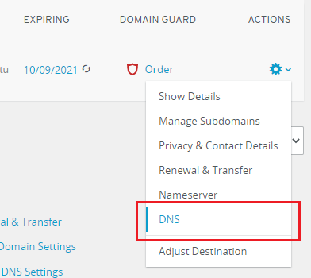
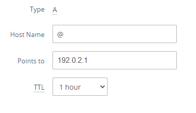
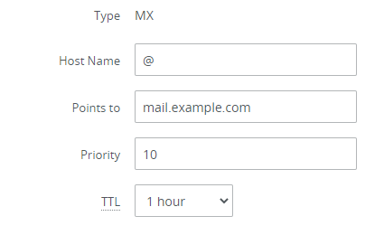

# Plesk: How to Migrate DNS to Ionos

[🏚️](../README.md) | [How To](/how-to/index.md)

#### Related Articles: [Plesk [not created yet]](#)

To put your website online with IONOS
Log in to IONOS.

In the “Domains” section of the Control Panel, next to your domain, click the image ionos 1 icon and then select “DNS”.

image ionos 2
Add the following A records:

|Type|Host Name|Points to|TTL|
|-|-|-|-|
|A|@|<your server IP>|1 hour|
|A|www|<your server IP>|1 hour|
|A|*|<your server IP>|1 hour|

To do so, click Add Record, select the A type, specify the data, and then click Save. Repeat this step as many times as many A records you need to add.

Note: IONOS adds the A record with the www hostname automatically unless you select not to add it.

The A records you have added have various hostnames and they do the following:

www points your domain with www (www.example.com) to your server IP address.
@ points your naked domain without www (just example.com) to your server IP address.
* points any subdomain (<anything>.example.com) to your server IP address.
Depending on your purpose, you may not need all three A records. However, if you are not sure which A records you need, we recommend that you add all three.

Note: If you want to use mail in Plesk, the A record with the * hostname is mandatory.

You have finished configuring DNS. Your website will be up and running once changes come into effect. Propagation can take up to 48 hours.

If you want to use mail in Plesk, proceed with the following steps. If you do not, your DNS configuration is finished.

Add the following MX record:

Type	Host Name	Points to	Priority	TTL
MX	@	<your server hostname>, for example, mail.example.com	10	1 Hour
To do so, click Add Record, select the MX type, specify the data, and then click Save.

You have configured DNS for mail. You can now use mail in Plesk.

## Related Articles

- N/A

## References

- https://docs.plesk.com/en-US/obsidian/administrator-guide/dns/putting-your-website-online.72225/#id4