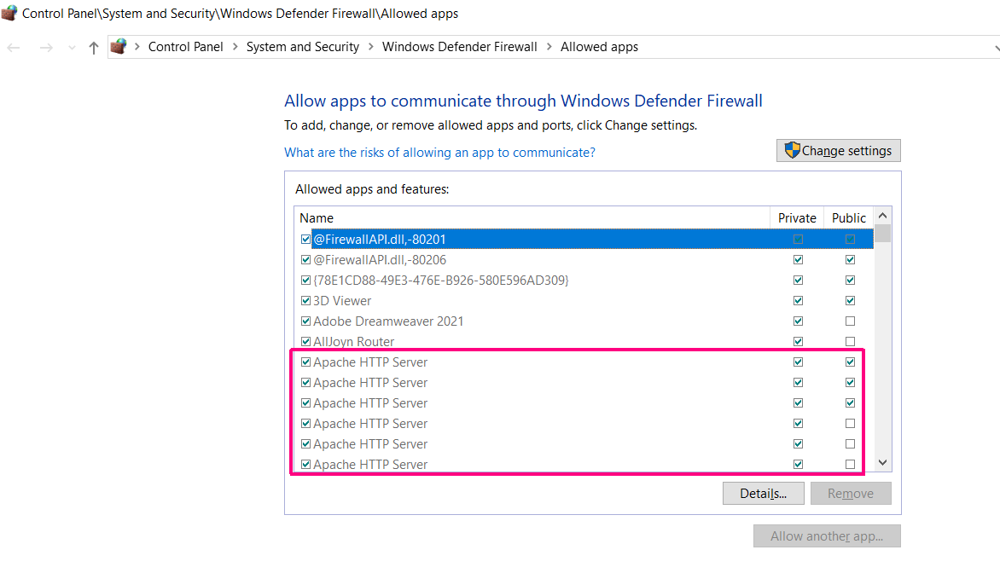

# WAMP: Can't connect to Wampserver 3 on Windows 10 from other machines on same local network

[🏚️](../README.md) | [How To](/how-to/index.md)

#### Related Articles: [WAMP](#), [Wampserver](#), [Apache](#)

If you’ve been struggling to connect to your WampServer or Apache server from other machines on your local network—even after correctly configuring your `httpd-vhost.conf` to `Require all granted`—you’re not alone. The solution often lies in **adjusting the firewall settings on the source machine** (the PC hosting the Apache server). Unfortunately, many guides gloss over this critical detail, leaving beginners in a loop of ineffective troubleshooting.  

This guide will walk you through solving this issue, explain why the firewall settings on **client devices or other leaf node machines** don’t matter, and include tips for connecting mobile devices.  

---

### **The Core Issue: Configuring the Right Firewall Settings**  

When setting up Apache for local network access, the key is to allow the Apache service to broadcast traffic through the source machine’s firewall. The adjustments need to be made on the **machine running the Apache server**, not the devices trying to connect to it. This ensures incoming and outgoing requests to the server are permitted within your private network.  

**Key Insight:** The host machine's firewall determines access. Changes to the firewalls of other machines in the network (or "leaf nodes") won’t resolve the issue.

---

### **Step-by-Step: Enabling Apache in Windows Firewall**  

#### 1. **Open Firewall Settings**
   - Press **Windows Key + S**, type *Firewall*, and select **"Allow an app through Windows Firewall"**.

#### 2. **Locate Apache in the App List**  
   Depending on your Windows version, Apache will appear under different names:
   - On **Windows 10**, look for **Apache HTTP Server**.
   - On **Windows 11**, look for **httpd**.  

   If it’s not listed, you may need to add it manually:
   - Click **Allow Another App**, then browse to the `httpd.exe` file, typically located in the `bin` directory of your Apache or WampServer installation folder.

#### 3. **Allow Private Network Access**  
   - Click **Change Settings** (admin privileges may be required).  
   - Locate the Apache entry, and ensure the box under **Private** is checked. This allows Apache traffic within your local network.  

#### 4. **Test Your Configuration**  
   From another device on the same network:
   - Open a browser and navigate to your server’s IP address (e.g., `http://192.168.x.x`).  
   - If your firewall is correctly configured, you should see the Apache default page or your hosted site.

---

### **Additional Considerations for Mobile Devices**  

Mobile devices, such as phones and tablets, often require extra attention:
   - **Ensure the device is on the same Wi-Fi network** as the host machine.
   - If your router isolates devices on the network for security (AP or client isolation), disable this feature to allow communication between devices.
   - Some mobile OS settings might restrict non-HTTPS traffic; ensure your browser or testing app allows HTTP connections.

---

### **Avoiding Common Pitfalls: Clarity for Beginners**  

One common stumbling block for beginners is confusion about which device’s firewall settings need adjustment. To save you unnecessary headaches:  

- The firewall adjustments **must be made on the source machine hosting the Apache server**.  
- There’s no need to modify firewall rules on client devices or other machines in the local network.

Many guides fail to specify this crucial detail, leading users to waste time troubleshooting on the wrong machine.

---

### **Conclusion**  

To allow local network access to your Apache server, the critical step is enabling Apache (or `httpd`) on the **source machine’s firewall**. By following this guide, you can ensure smooth connectivity and avoid the confusion that often plagues novices. With your server properly configured, you’ll be able to access it seamlessly from PCs, laptops, and mobile devices on your local network.  

Happy hosting, and may your local server run smoothly!  

## Related Articles

- N/A

## References

- https://chatgpt.com/c/674b591f-d020-8009-af72-a62fdef2efce
- https://chatgpt.com/c/674b4343-3c94-8009-8a56-325d2a7f6236
- https://chatgpt.com/c/67485f78-d11c-8009-aec5-b8959723acef
- https://chatgpt.com/c/67484da1-8430-8009-a5a4-d03de9059d7a

