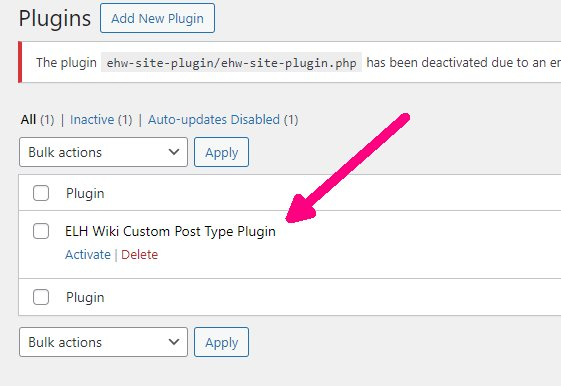

# WordPress: How to Create a Custom Post type

[🏚️](../README.md) | [How To](/how-to/index.md)

Custom post types (CPTs) is a concept that many new to WordPress development may find intimidating. If you ever look at the code for a CPT, or try to follow tutorials from the talented **[Alecaddd](https://www.youtube.com/watch?v=XTkbDBhXBQI&list=PLriKzYyLb28kR_CPMz8uierDWC2y3znI2&index=5&ab_channel=AlessandroCastellani)**, you may find yourself asking things like:

- What does it mean to "register" a post type?
- What is the difference between "register" and "create"?
- Why is there 30+ individual properties in a CPT and what are they for?
- When do I use rewrite - what am I rewriting?
- Should I use hierarchical or not?
- How do I associate a custom taxonomy with a CPT?

But, maybe you don't even know what a custom post type is or why you would want one.

## What is a custom post type?

WordPress core includes two main "post types": posts and pages. The main difference is that pages are for things that rarely change, like a contact page or an "About Us" page. Pages are also **hierarchical** (*out of scope for this post*), whereas posts are not.

Posts, on the other hand, are what a basically blog page is. But, there's only so much you can do with blog post.

What if your website is a blog, and you want each blog to link out to one or more recipe posts on your site? You could create a custom post type of "Recipe". Creating the post type means to write the code. Registering the post type means notifying WordPress that your new code exists and should be treated as a custom post type. Now, each CPT can have a different template assigned. That means that a recipe post could even be displayed within a blog post by using the `<iframe>` tag.

Also, each custom post type can have its own archive page template layout and styling. That means that 

## Creating a custom post type

In many "how-to" articles about creating custom post types (CPTs), the authors seem to assume that the reader has been making CPTs for years and so leaves out some -- I think -- important information, namely "Where do you put the code"?

They will usually say something like "you can add it to a plugin or put it in your functions.php", which is technically true. However, it is an incomplete instruction for a beginner to WordPress custom post types.

**What is a WordPress plugin anyway?** Basically, it is a folder with at least one file: the main plugin file. The main plugin file must have a specifically formatted file header comment.

So, now that we know what a plugin is, we can create a custom post type with its own plugin.

## Creating the Custom Post Type with a Plugin

Ok, let's discuss how to create a custom post type.

There are many ways to create a custom post type. The quickest way for a beginner is often to use a plugin. Until recently, Custom Post Type UI was the tool of choice. However, with Advanced Custom Fields (ACF) plugin having been acquired by WPEngine last year, the ACF plugin now has post type creation integrated. This makes it easier to create and manage all your custom content without the clutter of extra plugins.

But, you never know what changes a given plugin creator might pull. They could suddenly start charging for what used to be free. They could completely go out of business. They could just stop updating the plugin making it vulnerable to security issues.

That's why I recommend knowing how to write a custom post type from scratch with code. But, it's not really that complicated once you understand the basics.

## Creating a CPT with an Online Code Generator

Rather than write it all out by hand, it is much easier to use an online generator. Once you have a CPT generated, you can use that as a template for all your other CPTs. If for some reason the internet or a the generator site isn't available, you can simply duplicate to your template and globally replace your post type references. :)

The two that I've used are **[GenerateWP](https://generatewp.com/post-type/)** and **[Metabox](https://metabox.io/post-type-generator/)** Some other options include:

- https://wpturbo.dev/generators/post-type/
- https://www.wp-hasty.com/tools/wordpress-custom-post-type-generator/
- https://wp-skills.com/tools/custom-post-type-generator

I'll use Metabox going forward.

## Creating a Custom Post Type with Metabox

### Create Plugin Folder

First, let's create our plugin folder in `wp-content/plugins/` using this naming structure:

    [your-initials]-wiki-plugin

Based on my initials, I will create this plugin folder: **elh-wiki-plugin**

### Create Main Plugin File

Then, we will create our main plugin file. We'll do the customary thing and give it the same name as our folder. So our main plugin file path will be: 

`wp-content/plugins/elh-wiki-plugin/elh-wiki-plugin.php`

Good. Now, we need to add the plugin header like this (don't forget the `<?php` at the top):

    <?php
    /*
    Plugin Name: ELH Wiki Custom Post Type Plugin
    */

As long as you have the correct path, you can go to the "Plugins" page in the WordPress admin and your new plugin will show up in the list. Simply by adding the "Plugin Name:" property, _**you have now registered your plugin!**_

Our plugin doesn't do anything useful at this point, so we still have more to do. Let's fill out the rest of the common header comment properties. After we add a description, version, and author information, the plugin header should look something like this:

    <?php
    /*
    Plugin Name:    ELH Wiki Custom Post Type Plugin
    Description:    A plugin that registers the "doc" custom post type (CPT) for a wiki or knowledgebase website.
    Version:        0.00.00
    Author:         Eric Hepperle
    Author URI:     https://EricHepperle.com
    */

Refresh the Plugins page and your plugin entry should look like this:

## Generate the Custom Post Type Plugin Code

Next, navigate to https://metabox.io/post-type-generator/. Let's create a custom post type for a knowledgebase / wiki. The post type is often called "doc" or "article" or even "kb". We'll call ours "doc" because it's short and makes sense. But, basically a doc is a wiki article.

---

## References

- https://www.youtube.com/watch?v=XTkbDBhXBQI&list=PLriKzYyLb28kR_CPMz8uierDWC2y3znI2&index=5&ab_channel=AlessandroCastellani
- 